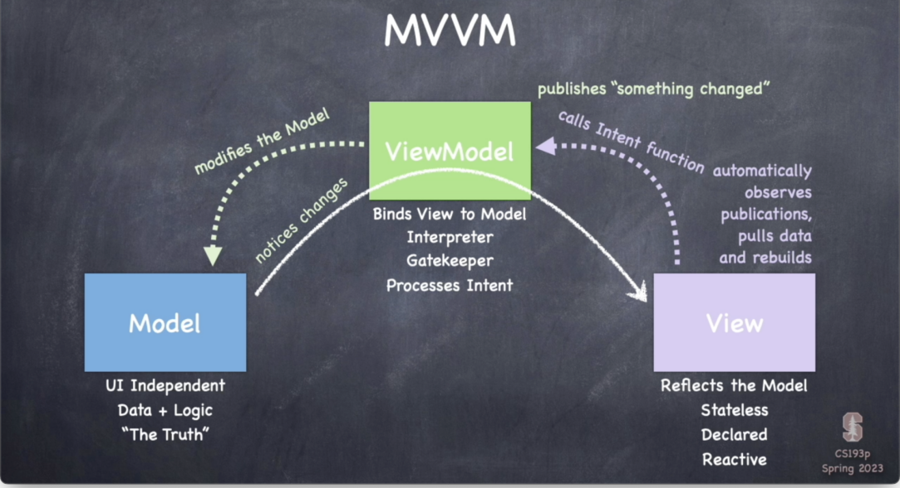

<h3>1. 什么是MVVM设计模式，它和MVC的区别是什么?</h3>

    - **MVVM设计模式**：

        MVVM（Model-View-ViewModel）本质上就是MVC的改进版,是前端架构设计的一种模式，旨在分离应用程序的开发逻辑和界面。
   
        MVVM应用的UI以及基础表示和业务逻辑被分成三个独立的类：视图 (`View`)，用于封装UI和UI逻辑；视图模型(`ViewModel` )，用于封装表示逻辑和状态；以及模型(`Model`)，用于封装应用的业务逻辑和数据。
   
        模式的核心在于 `ViewModel` 作为中介层，将数据模型 (`Model`) 与用户界面 (`View`) 绑定在一起，使界面与业务逻辑解耦。它的主要特点是双向数据绑定，UI自动更新，而无需显式的DOM操作。

   - **MVC模式**:
   
        (Model-View-Controller) 则是一种更传统的架构模式，该模式将相关程序逻辑划分为三个相互关联的组成部分：模型、视图和控制器.
        
        ***MVC*** 主要通过Controller来负责将用户输入数据传递到Model，Model更新数据后通知View进行展示。相比MVC，MVVM的ViewModel减少了对用户输入的显式操作，更多依赖数据的响应式更新。

   - **MVC和MVVM的区别**：
   
        ‌MVVM与MVC的主要区别在于MVVM各部分的通信是双向的，而MVC各部分通信是单向的。‌ MVVM真正将页面与数据逻辑分离，而MVC中未完全分离。

<h3>2. 在Stanford的Memories项目中，M/V/VM分别对应的代码是什么，他们之间的逻辑关系是怎么样的？</h3>

**Stanford Memories项目中的代码对应**：
   - **Model**：通常负责数据管理，如数据的存储、业务逻辑和持久化。在Stanford的Memories项目中，是MemoryGame.swift文件中的代码实现的。
   - **View**：界面展示层，负责用户交互。在Memories项目中是EmojiMemoryGameView.swift。
   - **ViewModel**：桥接Model和View的中介层，负责数据处理和业务逻辑，并通过数据绑定实时更新UI，在项目中是EmojiMemoryGame.swift。

   **逻辑关系**：

    MVVM的依赖关系可以描述为：View依赖于ViewModel，ViewModel依赖于Model。View通过数据绑定从ViewModel获取数据，并将用户的操作通过命令绑定传递给ViewModel。ViewModel则通过调用Model的方法来获取、更新和操作数据。
   - **Model** 是数据的源头，包含了业务逻辑，并通知 `ViewModel` 数据的更新。
   - **ViewModel** 负责数据的处理和状态的维护，它接收来自 `Model` 的数据，并通过绑定向 `View` 提供已处理的输出。ViewModel中的逻辑会解释用户的操作，并影响Model的状态。
   - **View** 直接通过数据绑定与 `ViewModel` 进行交互，自动更新显示内容。

<h3>3. 请解释图片中的所有名词：</h3>
    

   - **Model**：数据模型层，代表应用程序的数据和业务逻辑。它负责处理数据的获取、存储、验证和操作等，是与UI无关的部分。在MVVM中，Model通常是独立于View和ViewModel的，可以被多个ViewModel共享。

   - **ViewModel**：将 `Model` 和 `View` 绑定在一起的中介层，负责处理View的展示逻辑和用户输入，并将其转化为对Model的操作。ViewModel通过数据绑定将数据从Model传递给View，并监听View的变化，将用户的操作反馈给Model。ViewModel还可以包含一些辅助方法和属性，用于处理View的展示逻辑。

     - **Binds View to Model**：将 `View` 与 `Model` 绑定，实现双向数据绑定。
     - **Interpreter**：解释器，负责处理从View传递过来的数据和用户操作。
     - **Gatekeeper**：网关，控制 `Model` 的更新和验证数据。
     - **Processes Intent**：处理用户意图，通常通过用户交互触发的行为。
   - **View**：负责展示数据和接收用户的输入操作，和用户交互，观察 `ViewModel` 的变化并自动更新。代表应用程序的用户界面。在MVVM中，View应该尽量保持简单，只负责展示数据和与用户的交互，不包含业务逻辑。
     - **Reflects the Model**：展示 `Model` 中的数据，用户通过界面与数据交互。
     - **Stateless**：无状态， `View` 本身不管理数据，所有数据状态都由 `ViewModel` 维护。
     - **Declared**：声明式编程风格，如SwiftUI和React等框架中的声明式UI。
     - **Reactive**：响应式，当 `ViewModel` 中的数据发生变化时， `View` 会自动响应并更新。

